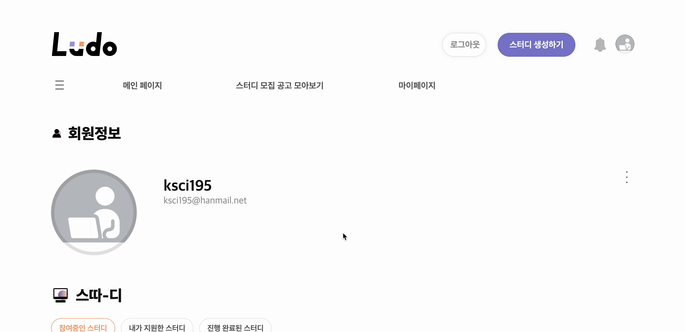

<div align="center">
 
  <h1>나도 배운걸 활용하고 싶다</h1>
  배운걸 활용하고 싶은데 고민이신가요?
  <br/>
  여러 사람들과 체계적으로 스터디를 관리하고 싶으신가요?
  <br/>
  걱정마세요. 당신이 원하는 스터디 Ludo가 찾아드릴게요.
  <br/><br/>
</div>

## 📎 [Ludo 바로가기](https://ludoapi.store/)

## 💡 프로젝트 소개
**스터디 지원부터 참여, 관리까지**<br>
**누구나 쉽고 빠르게 지속 가능한 스터디에 참여할 수 있는 스터디 플랫폼입니다.**

## 🎬 프로젝트 진행상황
### ✔︎ 진행기간 : 2023.12.15 ~ 진행 중
### ✔︎ MVP 구현 후, 1차 유저 테스트 : 2024.3.26~2024.3.30

## 📋 프로젝트 자료
### 🖌 기획
#### 📓 [유저 스토리](https://docs.google.com/spreadsheets/d/14xlWLKUEV8hrthsYjRFmHcRLDtWRKmthFgiiYNGrhwA/edit#gid=0) 
#### 📓 [페이지 Flow Chart](https://www.figma.com/file/aCw6w4LCjTczfRGlmD1bhV/Page-flow-chart?type=whiteboard&node-id=0-1&t=99pRF5UZwzy7u5i5-0) <br>
#### 📓 [브레인 스토밍](https://www.figma.com/file/VSxOLuyKKZobloOcFja93N/Brain-storming?type=whiteboard&node-id=2-94&t=UZ5vevbuqABdPsBq-0)
#### 📓 [IA(정보 구조도)](https://www.figma.com/file/Sho4QHn0XqEptYBBlbf704/Page-Layout?type=design&node-id=206-31&mode=design&t=YTrENpZjUN2rJ4Dj-0)

### 📄 기능 명세
#### 📓 [API 설계서](http://34.82.109.226/swagger-ui/index.html#/)
#### 📓 [페이지 기능명세서](https://docs.google.com/spreadsheets/d/1TejPT93Gi3ztsGqPt5lpAY1UMFvruP80D9pFmkwy1fI/edit?invite=CLS0q4EH#gid=0)

### 🎨 디자인
#### 📓 [페이지 디자인](https://www.figma.com/file/Sho4QHn0XqEptYBBlbf704/Page-Layout?type=design&node-id=281-174&mode=design&t=TeYlIf3mTucRE1I6-0)
#### 📓 [디자인 시스템](https://www.figma.com/file/OLgSF11mOFN5MpcYzpD3N3/Design-System?type=design&node-id=1121-950&mode=design&t=2ZrFmOMMTcunVk5h-0)


## 🛠 사용한 기술 스택
 <br>
 <br>
  <br>
  <br>
  <br>
 <br>


## 🛠 주요 기능

### ✔︎ 스터디 모집공고 조회
메인페이지에서 원하는 카테고리의 스터디 모집공고를 확인할 수 있어요.
<details markdown="1">
<summary>메인페이지에서 스터디 조회</summary>
  
</details>

모집공고 모아보기 페이지에서는 필터를 통해 원하는 스터디 모집공고를 확인할 수 있어요.

<details markdown="1">
<summary>모집공고 모아보기 페이지에서 필터링을 통한 스터디 모집공고 조회</summary>
  
</details>

### ✔︎ 스터디 지원
스터디 모집공고 상세 페이지에서 원하는 스터디 모집공고에 지원할 수 있어요.
<details markdown="1">
<summary>스터디 지원</summary>
  
</details>

### ✔︎ 스터디 생성
로그인한 사용자는 스터디 생성페이지에서 스터디를 생성할 수 있어요.
<details markdown="1">
<summary>스터디 생성</summary>
  
</details>

### ✔︎ 스터디 모집공고 생성
생성된 스터디에 대한 모집공고를 생성할 수 있어요.
<details markdown="1">
<summary>스터디 모집공고 생성</summary>
  
</details>

### ✔︎ 마이페이지
마이페이지에서 참여중인 스터디, 지원한 스터디, 진행 완료된 스터디를 확인할 수 있어요.
<details markdown="1">
<summary>마이페이지</summary>
  
</details>

## ⚙️ 개발환경 설정 

### 1. 의존성 모듈 설치
```bash
yarn install
``` 

### 2. Local 개발환경에서의 https 설정
#### 🔨 인증서를 생성하는 도구인 mkcert 설치
- Mac OS
  ```
    brew install mkcert
  ```
- Windows
  ```
    choco install mkcert
  ```
#### 🔨 인증서 생성
- 로컬을 인증된 발급 기관으로 추가
  
  ```
    mkcert --install
  ```
- 인증서 생성
  ```
    mkcert local.ludoapi.store
  ``` 
- 생성된 local.ludoapi.store.pem, local.ludoapi.store-key.pem 키를 루트의 cert 폴더로 이동
    ```
    ludo-frontend
    └── cert                         # 인증서 key를 보관하는 폴더
        └── local.ludoapi.store.pem
        └── local.ludoapi.store-key.pem
   ```
  

### 3. .env 설정
```
VITE_MOCK_API_URL = Mock API Endpoint
VITE_BASE_API_URL = Base API Endpoint
```

### 4. 개발환경 실행
- Mac OS
  ```
    yarn start:mac 
  ```
- Windows
  ```
    yarn start:windows
  ```

### 5. Storybook 실행

```sh
yarn storybook
````

## 📁 Directory Structure
```
ludo-frontend
├── .github                         # Feature, PR, Bug template
├── .husky                          # pre-commit hook
├── public                          # public
└── src
    ├── Apis                        # api 호출 Function
    ├── Assets                      # resoucres
    ├── Components                  # 페이지를 구성하는 components           
    ├── Constants                   # api, message, queryStirng, route 및 공통적으로 사용되는 constants                      
    ├── Hooks                       # Custom Hooks                        
    ├── Layout                      # 프로젝트 뼈대를 구성하는 Layout                         
    ├─- Mocks                       # MSW를 활용한 Mock data, handler                         
    ├── Pages                       # Pages     
    ├── Router                      # Routes config
    ├── Providers                   # Login, Query Provider                          
    ├── Shared                      # 공통으로 사용되는 값 및 Dummy data                          
    ├── Store                       # Zustand를 사용한 전역 Store                         
    ├── Styles                      # Global Style                         
    ├── Types                       # 프로젝트 전반에 걸쳐 사용되는 Type 정의                         
    ├── Utils                       # date, axios 관련 util 함수                       
```


## 🙋🏻‍♂️ FE 팀원
<table >
  <tbody>
      <td align="center">
        <a href="https://github.com/kmin-jeong">
            
<h3><b>타로</b></h3></a></td>
        <td align="center">
        <a href="https://github.com/SungHyun627">
            
<h3><b>김성현</b></h3></a></td>
  </tbody>
</table>


